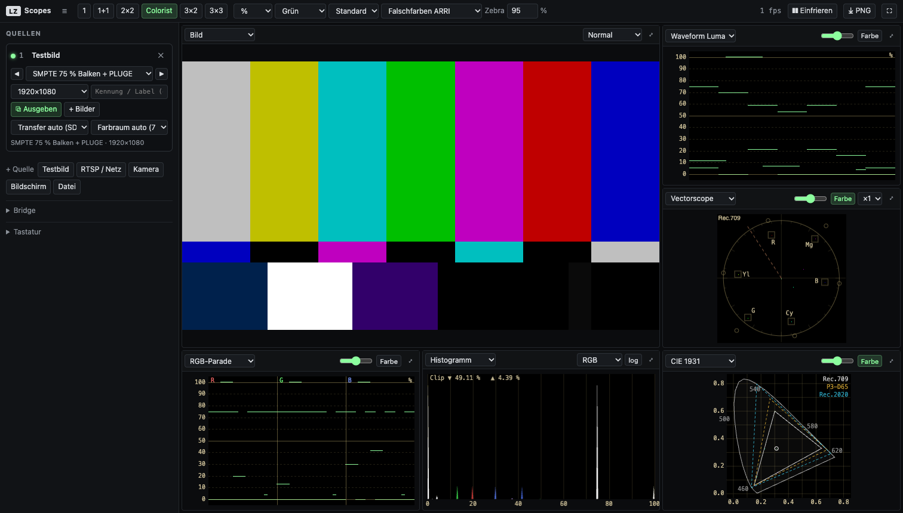

# LZ Scopes

Software-Messtechnik im Browser: Waveform, Parade, Vectorscope, Histogramm, CIE-Diagramm, Falschfarben und Messwerte, auch für **RTSP-Streams** und andere Netzwerkquellen. Vorbilder: VMA Scope, Nobe OmniScope, HDRScopes, LiveScopes.tv, openrv-web.



## Start

```bash
npm install
npm run dev        # UI http://localhost:4191, Bridge auf 4190
# oder Produktion
npm run build && npm start   # alles auf http://127.0.0.1:4190
```

Voraussetzung: `ffmpeg` und `ffprobe` im `PATH` (`brew install ffmpeg`). Ohne Bridge funktionieren nur Kamera, Bildschirm und Dateien.

## Quellen

| Quelle | Weg |
|---|---|
| `rtsp://`, `rtsps://`, `rtmp://`, `rtp://`, `udp://`, `srt://`, `tcp://`, `http(s)://` (auch HLS) | Bridge: ffprobe → ffmpeg → rohe RGBA-Frames per WebSocket |
| `test:bars`, `test:ramp`, `test:testsrc`, `test:colors` | Bridge: lavfi-Testbilder |
| Testbild-Generator (siehe unten) | direkt im Browser, auch als Ausgabefenster |
| Kamera, Bildschirm, Video-/Bilddatei | direkt im Browser |

Mehrere Quellen gleichzeitig, jedes Panel wählt seine Quelle. Pro Stream einstellbar sind Analyseauflösung, Bildrate, 8 oder 16 bit (für 10-bit/HDR), RTSP über TCP oder UDP, Transfer (SDR/PQ/HLG) und Farbraum (709/2020/601). „auto“ übernimmt die Stream-Metadaten.

## Scopes

- **Waveform** Luma, RGB-Overlay, RGB-, YRGB- und YCbCr-Parade. Skala in %, 8 bit, 10 bit (Legal-Range-Codes) oder cd/m² (PQ absolut, HLG bezogen auf ein 1000-cd/m²-Display, SDR nach BT.1886 mit 100 cd/m²)
- **Vectorscope** mit 75-%- und 100-%-Zielen passend zur Matrix, Hautton-Linie, Zoom ×1/×2/×5, Spur optional in Bildfarbe
- **CIE 1931 xy** mit Spektralzug, Rec.709, P3-D65, Rec.2020 und D65
- **Histogramm** RGB, Luma, getrennt, linear oder log, mit Clipping-Anteil
- **Bild** mit Falschfarben (ARRI-Schema), Zebra, Clipping-Anzeige und Luma. Ein Klick setzt einen Messpunkt, der zusätzlich in Waveform und Vectorscope markiert wird
- **Messwerte**: Quelle, Codec, Metadaten, Y' min/max/Mittel (bei HDR in cd/m²), Clipping je Kanal, verworfene Frames

Layouts 1, 1+1, 2×2, Colorist, 3×2, 3×3. Doppelklick schaltet ein Panel solo. Einfrieren, PNG-Export, Vollbild. Die Einstellungen bleiben im Browser gespeichert.

**Tasten:** `1`–`6` Layout · `Leertaste` Einfrieren · `F` Vollbild · `S` PNG · `B` Seitenleiste · `Esc` Solo beenden bzw. Messpunkt löschen

## Testbilder

Die Quelle *Testbild* erzeugt die Muster selbst, in 720p bis 2160p. Rampen und Zonenplatte werden pixelgenau geschrieben, damit der Browser sie nicht dithert.

- **Vollfeld** Rot, Grün, Blau, Weiß, Grau 50 %, Grau 18 %, Schwarz
- **Grau** Verlauf, Verläufe W/R/G/B, 11 Graustufen, Graukeil in TE-165-Anordnung (lineare 10-%-Stufen), wandernder Verlauf, PLUGE
- **Geometrie** Schachbrett, Konvergenzgitter, Fadenkreuz, Kreisraster, Zonenplatte (auch bewegt), sichere Bereiche nach EBU R 95
- **Farbe** SMPTE 75 % und 100 % mit PLUGE, EBU 100/0/75/0 und 100/0/100/0, Sättigungsverläufe, Farbkreis, ColorChecker (Näherung)
- **Animiert** Farbwechsel, Farbwechsel-Verlauf, dreigeteilt, bewegte Diagonalen, Regenbogenfluss, Chroma-Crawl
- **Testbild** mit Kreis, Balken, Frequenzgittern und Uhr
- **HDR** PQ-Graukeil 0–10 000 cd/m², HLG-Graukeil, PQ-Verlauf mit Referenzweiß 203; die Scopes schalten dabei automatisch auf PQ bzw. HLG
- **LZ Displaytest** die 20 Displaytestbilder (1920×1080) aus `Broadcast/displaytest`
- **Eigene Bilder** über *+ Bilder*, gelten für die laufende Sitzung

Optional lässt sich eine Kennung einblenden. *⧉ Ausgeben* öffnet das Muster in einem eigenen Fenster (`?out=<id>&w=&h=&label=`) für Monitor, Beamer oder Capture: `←`/`→` wechseln, `F` Vollbild, `L` Label. In nativer Auflösung und im Vollbild wird 1:1 ausgegeben.

Grenze: Canvas arbeitet in Full-Range-RGB, deshalb gibt es keine Pegel unter 0 %. Die PLUGE-Stufe −4 % liegt dadurch auf 0 %.

## Einbetten

`src/index.ts` exportiert `ScopeView`: ein WebGL-Canvas mit wählbaren Scopes, ohne Framework.

```ts
import { ScopeView, Source } from 'lz-scopes/src';
const view = new ScopeView(el, { scopes: ['wf-luma', 'vector', 'parade', 'hist'] });
const src = new Source('stream', 'Kamera 1');
src.connectFrames('ws://bridge/scope/1');  // Frame-Protokoll: docs/frame-protocol.md
view.setSource(src);
```

## Technik

- Die **Bridge** (`server/index.mjs`) ermittelt mit ffprobe Auflösung und Farbmetadaten und startet dann ffmpeg: Skalierung auf die Analysebreite, Ausgabe `rgba` oder `rgba64le` als Rohdaten. Hinkt der Browser hinterher, verwirft sie Frames, statt eine Warteschlange aufzubauen. Die Y'CbCr-Matrix gibt sie ffmpeg explizit vor, weil swscale bei ungetaggten Streams sonst BT.601 annimmt und HD-Kameras verfälscht. Die Transferfunktion bleibt unangetastet, PQ- und HLG-Codewerte kommen also unverändert an.
- Der **Renderer** (`src/renderer.ts`) ist ein einziger WebGL2-Kontext hinter allen Panels. Jeder abgetastete Pixel wird als Punkt additiv in ein Float-Target gestreut (bis 4 Mio. Punkte pro Scope und Frame) und danach per `1 − e^(−k·x)` dargestellt. 16-bit-Frames liegen als `RGBA16UI`-Textur vor.
- Die Bridge lauscht standardmäßig nur auf `127.0.0.1` und akzeptiert ausschließlich Netzwerk-URLs und die Testbilder: keine lokalen Dateien, keine ffmpeg-Optionen, keine Shell. Für Zugriff aus dem Netz gibt es `--host 0.0.0.0`.

Konfiguration: `--port`/`PORT` (4190), `--host`/`HOST`, `FFMPEG`, `FFPROBE`.

## Grenzen

- Die Werte sind Full-Range-R'G'B' nach der Wandlung. Sub-Black und Super-White außerhalb 16–235 werden abgeschnitten, eine Legal/Illegal-Prüfung auf Y'CbCr-Ebene gibt es noch nicht.
- Kein Audio, kein NDI, kein SDI (DeckLink/AJA): Die Homebrew-Version von ffmpeg bringt dafür keine Unterstützung mit.
- Browser-Quellen (Kamera, Datei) liefern immer 8 bit und durchlaufen das Farbmanagement des Browsers.

## Tests

```bash
npm test        # Farbmathematik (PQ, HLG, Matrizen, XYZ), Statistik, Bridge-Eingabeprüfung
npm run typecheck
```

Zum Ausprobieren mit echtem RTSP: `brew install mediamtx`, dann `mediamtx` starten und z. B. `ffmpeg -re -f lavfi -i testsrc2=size=1920x1080:rate=25 -c:v libx264 -f rtsp rtsp://127.0.0.1:8554/test` veröffentlichen.
