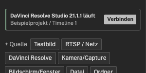
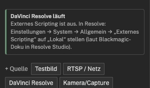
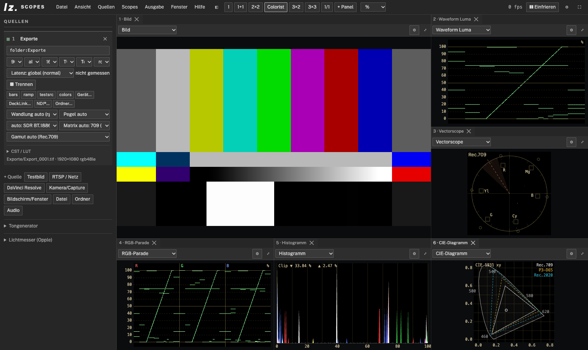
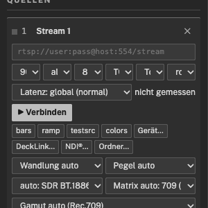

# Inputs: Resolve, windows, folders, capture cards

How a picture gets into LZ Scopes. All inputs are in the **Sources** sidebar on the left. Add new ones with **+ Source**. Each source card sets how the picture is measured: transfer, matrix, gamut, CST/LUT. (Button names are quoted as in the German interface; with the English interface the corresponding English labels apply.)

| Input | Bit depth | When |
|---|---|---|
| DaVinci Resolve (scripting) | 16 bit | graded picture from the Resolve viewer, no extra hardware |
| Clean feed via capture card | 10 bit | Resolve outputs through a DeckLink/UltraStudio, LZ Scopes captures it with a card |
| Clean feed or window via screen capture | 8 bit | quick, no hardware; the display alters colours and levels |
| Folder | 8 bit (browser), 16 bit (bridge) | stills from Lightroom, Capture One, Resolve |
| Capture card, DeckLink, NDI® | 8–16 bit | cameras, switchers, routers |

## DaVinci Resolve

LZ Scopes takes the current picture of the Resolve viewer through Resolve's scripting API. The picture is graded and has 16 bit. About 7 pictures per second are measured. For this, the bridge pulls the picture from Resolve as a TIFF still.

**Requirements**

- DaVinci Resolve **Studio**.
- In Resolve: **Preferences → System → General → External scripting using: Local**.
- Python 3 on the computer (macOS: via the Xcode Command Line Tools).
- LZ Scopes runs as the desktop app or with `npm start` on the same computer as Resolve.

**Connect**

A running Resolve appears in the sidebar by itself, with project and timeline. Click **Verbinden** (connect) to add the source *DaVinci Resolve*.

If external scripting is off, the sidebar says where to switch it on. There is no connect button then.

Alternatively: **+ Quelle → DaVinci Resolve**.

**Resolve on another computer**

1. Start the bridge on the Resolve computer, with `npm start -- --host 0.0.0.0` or as the desktop app with `LZS_HOST=0.0.0.0`.
2. Enter that computer under **Einstellungen → Bridge / ffmpeg → Adresse** (settings) in LZ Scopes, e.g. `http://<host>:4192`.
3. The sidebar then shows that computer's Resolve.

There is no network scan of its own. Resolve writes the still to the disk of the Resolve computer, so the bridge has to run there.

**Good to know**

- What the viewer shows is measured: the picture at the current playhead, graded.
- During playback the measurement lags slightly behind. For a smooth real-time picture use the clean feed (next section).
- The timeline timecode is passed along.

## Clean feed

Resolve can output the viewer picture without UI: **Workspace → Video Clean Feed** to a second display. With Blackmagic Desktop Video it also works through a DeckLink or UltraStudio card.

- **Through a capture card (recommended):** Feed the output into a capture card, in the same or another computer. In LZ Scopes add an **RTSP / Netz** source and choose **Gerät…** or **DeckLink…** (see *Capture cards*). This keeps 10 bit, with no display colour management in between.
- **Through screen capture:** **+ Quelle → Bildschirm/Fenster** and choose the clean-feed display. Quick to set up, but it measures only 8 bit. The operating system also converts the picture into the display colour space. Not suitable for colour judgement.

## Window with crop (Resolve, Lightroom, Capture One)

1. **+ Quelle → Bildschirm/Fenster**. The desktop app lists all windows with thumbnails; the browser shows its own picker.
2. Choose the application window.
3. Drag a rectangle around the viewer in the *Bild* (picture) panel.
4. Click **✂ Zuschnitt = Rahmen** (crop = rectangle) in the source card. From then on only the viewer is measured. **Zuschnitt aus** removes the crop.

As with screen capture: 8 bit, and window contents pass through the system's colour management. Use this for composition, exposure and rough levels, not for colour approval.

## Folder (Lightroom, Capture One, Resolve stills)

The **newest picture** in a folder is always shown. Export a new still and it appears in the scopes right away.

- **+ Quelle → Ordner** (browser): JPG, PNG, WebP or AVIF, 8 bit. Needs Chrome, Edge or the desktop app.
- **Ordner… in a stream card** (bridge): 16-bit TIFF, DPX, 16-bit PNG, JPEG, WebP and EXR at full depth, also on another computer. The desktop app opens a folder dialog. With `npm start` you release the folder at start: `--watch-dir <folder>`. Only folders named explicitly are released.

**Export routes**

- **Lightroom Classic:** File → Export, location = watched folder, TIFF 16 bit. Save it as a preset, then File → Export with Preset.
- **Capture One:** a process recipe with the watched folder as output folder and TIFF 16 bit, then Process.
- **Resolve:** grab a still on the Color page and export it from the gallery (right-click) into the folder.

Set the colour space of the export at the source, e.g. transfer **sRGB** for an sRGB export. LZ Scopes does not read embedded ICC profiles. The menu routes in Lightroom and Capture One are described, but not checked against the applications.

## Capture cards, DeckLink, NDI®

An **RTSP / Netz** source has these buttons below the address field:

- **Gerät…** (device): cards that appear as system devices (USB capture, Magewell, Blackmagic with WDM or AVFoundation driver). The bridge takes the deepest raw format the card offers. Mode, frame rate and pixel format can be fixed.
- **DeckLink…**: Blackmagic DeckLink and UltraStudio through the DeckLink helper, with 10 bit, format detection and timecode. Needs Blackmagic Desktop Video. If the helper or the driver is missing, the app says so. Not yet tested with real hardware.
- **NDI®…**: NDI sources on the network. Needs the NDI runtime from [ndi.video](https://ndi.video/). LZ Scopes does not ship it.
- **Ordner…**: see above.

Use **Wandlung** (conversion) and **Pegel** (levels) to fix matrix and range when a card labels its signal wrongly or not at all.

NDI® is a registered trademark of Vizrt NDI AB.
